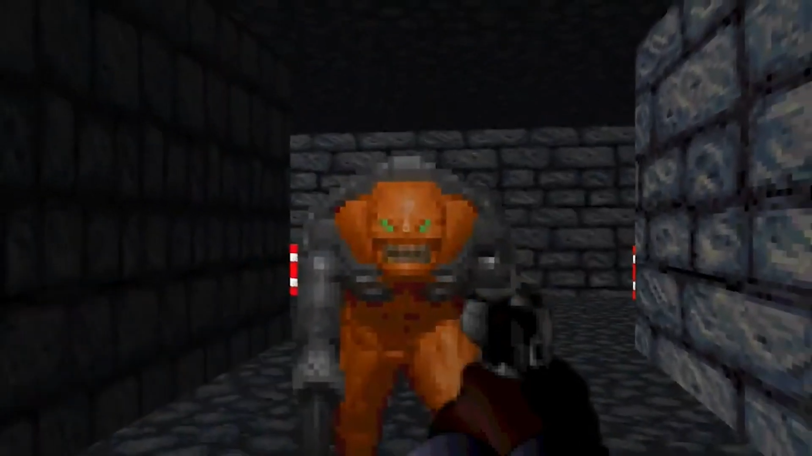

# Retro first person shooter game

 

This repository contains the game source code and Visual Studio solution.

## Highlights
Written in C++ for Windows, rendered with Vulkan and uses DirectX Audio 2 for audio.

## Build steps
* From the repository root directory run `at_task1/Shaders/CompileShaders.bat` to compile the shader binary files.
* Open at_task1.sln.
* Select release configuration and build the project.

This will create a Binary folder in the repository root directory containing a folder called x64-Release. 
Inside this folder is the executable for the game called at_task1.exe. Run the executable to play the game.

The game is designed to be played with an Xbox controller however, mouse and keyboard controls are available. 

### Gamepad controls  
Left thumbstick - Move  
Right thumbstick - Look  
Right trigger - Fire gun  
A button - Interact  
Options button - Confirm menus  

### Keyboard controls  
WASD - Move  
Mouse - Look  
Left click - Fire gun  
E key - Interact  
Space bar - Confirm menus  
Escape - Exit application  
